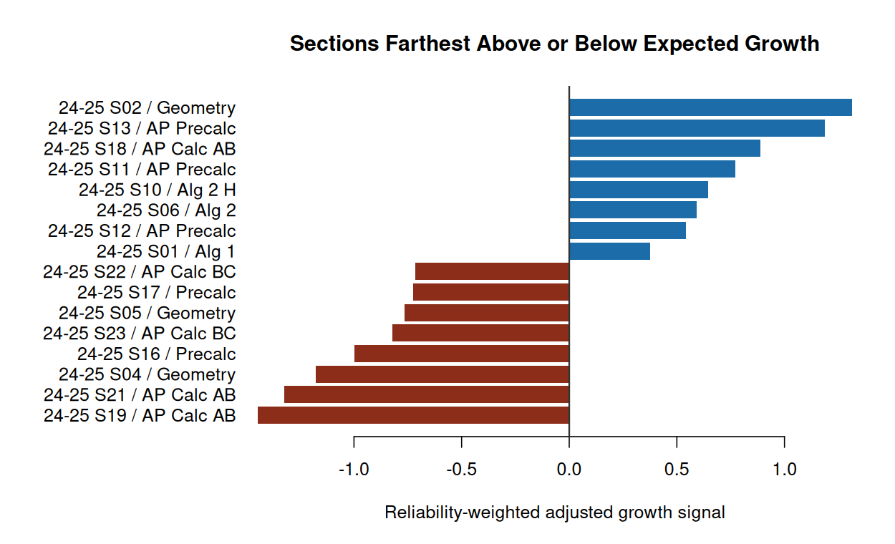

# Assessment Growth and Section Performance Analytics in R

Public-safe education analytics project in R that evaluates beginning-of-year
to end-of-year assessment improvement and turns assessment history into a
future-facing statistical review system. The report answers a stakeholder
question first: which teacher, course, and section patterns in the latest
completed year deserve review before the next assessment cycle after accounting
for starting performance, readiness, attendance, course track, grade level, and
school-year context?

The extract uses simulated identifiers and generalized readiness behavior from
a bootstrapped assessment workflow. It is not a release of the original
assessment artifacts or real student-level records. The project is designed for
business analytics, BI, education analytics, and data strategy portfolio review:
the emphasis is decision framing, BOY/EOY improvement analysis, adjusted growth
modeling, future review signals, validation, and clear communication.

Portfolio page:
https://grant-mccurdy.github.io/projects/statistical-risk-modeling-r.html

## Primary Preview

Open the knitted PDF report first:

[reports/assessment_growth_section_performance_report.pdf](reports/assessment_growth_section_performance_report.pdf)

This is the primary reviewer artifact. It uses a formal statistics-report
structure: recommendation and direct answers first, data audit next, then model
selection, latest-year review targets, section evidence, diagnostics, and
public-safety notes.



## Stakeholder Preview

- **Purpose:** train an expected-growth baseline on prior years, then use the
  latest completed year to flag teacher, course, and section patterns for
  future review.
- **Headline metric:** average raw BOY/EOY gain is 5.72 points across 1,737
  paired records.
- **Analytic layer:** compare observed gain with expected gain after controlling
  for starting score/readiness, prior-year history, attendance, course track,
  grade level, section composition, and school-year context.
- **Guardrail:** use teacher/course/section signals for instructional review and
  follow-up, not automated teacher evaluation or personnel decisions.

## Technical Skills Demonstrated

- Public-safe bootstrapped/generalized education extract and reproducible
  BOY/EOY growth table
- Paired section improvement analysis and confidence intervals
- Adjusted expected-growth modeling in R
- Candidate-family comparison across direct-growth linear, polynomial,
  history/composition, interaction, cyclic, GAM, regularized-regression,
  regression-tree, random-forest, ranger-forest, gradient-boosting, adaptive
  MARS, validation-ensemble, stacked-ensemble, EOY-derived benchmark, and
  leakage-check specifications
- Repeated cross-validation, rolling-origin temporal validation, process
  validation, locked latest-year holdout review, feature-stability checks, and
  null-permutation benchmarking
- Latest-year action evaluation, bootstrap intervals, feature diagnostics, and
  residual diagnostics
- Reliability-weighted teacher/course/section review priorities
- Mixed-effects shrinkage review for teacher/course/section residual patterns
- BH-adjusted q-values for multiple-review control
- Evidence reconciliation across adjusted gaps, bootstrap stability, shrinkage,
  and multiple-review control
- Teacher/course review-priority views for instructional planning
- Sensitivity checks comparing raw and adjusted section rankings
- Executive-facing communication with public-safety guardrails

## Reviewer Path

1. Open `reports/assessment_growth_section_performance_report.pdf` for the
   primary preview report.
2. Read `reports/executive_brief.md` for the one-page leadership summary.
3. Review `docs/model-card.md` for intended use, limitations, and monitoring.
4. Review `docs/data-dictionary.md` for modeling table definitions.
5. Review `docs/methodology.md` for modeling choices and validation logic.
6. Inspect `R/` for the reproducible R implementation.
7. Run `make all` to regenerate the public-safe extract, model artifacts,
   report, figures, and public-safety validation.

## Quick Start

The core build uses R and `make`. If `mgcv`, `rpart`, `randomForest`, `gbm`,
`glmnet`, `ranger`, `earth`, and `lme4` are installed, the model search includes GAM,
regression-tree, random-forest, gradient-boosting, regularized-regression,
adaptive MARS, stacked-ensemble, and mixed-effects shrinkage candidates;
otherwise optional families are skipped and documented.

```bash
cd /home/grant/repos/public/statistical-risk-modeling-r
make all
```

If `make` is unavailable, run the same steps directly:

```bash
Rscript --vanilla R/generate_synthetic_data.R
Rscript --vanilla R/fit_growth_models.R
Rscript --vanilla R/render_markdown_report.R
Rscript --vanilla R/validate_public_safety.R
Rscript --vanilla R/validate_model_outputs.R
```

Optional PDF rendering is available when `rmarkdown`, Pandoc, and a LaTeX
engine such as `pdflatex` are installed:

```bash
make report-pdf
```

## Current Structure

```text
statistical-risk-modeling-r/
├── R/
│   ├── generate_synthetic_data.R
│   ├── model_utils.R
│   ├── fit_growth_models.R
│   ├── render_markdown_report.R
│   ├── run_pipeline.R
│   ├── validate_model_outputs.R
│   └── validate_public_safety.R
├── data/
│   ├── raw/
│   │   ├── README.md
│   │   └── synthetic_education_assessment_long.csv
│   └── processed/
├── docs/
│   ├── methodology.md
│   ├── data-dictionary.md
│   ├── model-card.md
│   └── public-safety.md
├── figures/
├── reports/
│   ├── README.md
│   ├── assessment_growth_section_performance_report.Rmd
│   ├── assessment_growth_section_performance_report.md
│   ├── assessment_growth_section_performance_report.pdf
│   └── executive_brief.md
├── Makefile
├── LICENSE
└── README.md
```

## Evidence Packet

The generated evidence packet includes:

- `data/raw/synthetic_education_assessment_long.csv`
- `data/processed/education_section_growth.csv`
- `reports/assessment_growth_section_performance_report.pdf`
- `reports/assessment_growth_section_performance_report.md`
- `reports/executive_brief.md`
- `docs/data-dictionary.md`
- `docs/model-card.md`
- `reports/growth_model_comparison.csv`
- `reports/growth_model_comparison_display.csv`
- `reports/growth_model_search_grid.csv`
- `reports/growth_model_strength.csv`
- `reports/growth_model_family_summary.csv`
- `reports/growth_model_selection_rationale.csv`
- `reports/growth_final_metrics.csv`
- `reports/shrinkage_status.csv`
- `reports/shrinkage_review.csv`
- `reports/review_evidence_reconciliation.csv`
- `reports/intervention_targets.csv`
- `reports/latest_teacher_review.csv`
- `reports/latest_course_review.csv`
- `reports/latest_section_review.csv`
- `reports/future_review_priorities.csv`
- `reports/model_temporal_validation.csv`
- `reports/rolling_origin_validation.csv`
- `reports/process_validation.csv`
- `reports/locked_holdout_validation.csv`
- `reports/model_bootstrap_validation.csv`
- `reports/model_validity_targets.csv`
- `reports/model_signal_ceiling.csv`
- `reports/null_permutation_benchmark.csv`
- `reports/feature_importance.csv`
- `reports/feature_stability.csv`
- `reports/flag_stability.csv`
- `reports/model_dependency_status.csv`
- `reports/section_ttests.csv`
- `reports/section_adjusted_signals.csv`
- `reports/teacher_growth_summary.csv`
- `reports/course_growth_summary.csv`
- `reports/growth_diagnostics.csv`
- `reports/growth_sensitivity.csv`
- `figures/growth_distribution.png`
- `figures/baseline_growth_shape.png`
- `figures/growth_model_comparison.png`
- `figures/section_adjusted_signals.png`
- `figures/teacher_course_summary.png`
- `figures/growth_diagnostics.png`

## Validation Commands

```bash
make all        # rebuilds data, models, report, figures, and safety checks
make data       # regenerates the modeling extract
make model      # runs model comparison and diagnostics
make report     # renders the Markdown report
make report-pdf # renders the knitted PDF report
make validate   # checks public-safety and model-output rules
```

## Dependency Notes

Install the optional modeling/reporting packages for the full portfolio build:

```r
install.packages(c("mgcv", "rpart", "randomForest", "gbm", "glmnet", "ranger", "earth", "lme4", "rmarkdown", "knitr"))
```

Then run:

```bash
make all
```

The knitted PDF target uses `rmarkdown`, `knitr`, Pandoc, and `pdflatex`. No
API credentials, private files, or network access are required.

## Public Safety

The repository uses public-safe education assessment records with simulated
identifiers and generalized score/readiness behavior. It does not include
private course prompts, instructor materials, exams, syllabi, lecture
transcripts, raw private coursework files, real student-identifiable data, real
patient data, credentials, or private exports.

See `docs/public-safety.md` for the release notes and exclusion policy.
