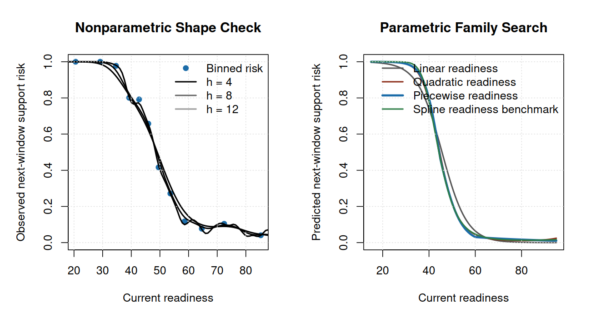

# Statistical Risk Modeling in R

Public-safe education analytics project in R that turns assessment-readiness
evidence into a support-review prioritization workflow. The report answers a
stakeholder question first: when support capacity is limited, which assessment
transitions should be reviewed before the next assessment window, and what
tradeoff does each review threshold create?

The extract uses simulated identifiers and generalized readiness behavior from
a bootstrapped assessment workflow. It is not a release of the original
assessment artifacts or real student-level records. The project is designed for
business analytics, BI, education analytics, and data strategy portfolio review:
the emphasis is decision framing, interpretable statistical modeling,
validation, calibration, threshold interpretation, and clear communication.

Portfolio page:
https://grant-mccurdy.github.io/projects/statistical-risk-modeling-r.html

## Primary Preview

Open the knitted PDF report first:

[reports/statistical_risk_modeling_report.pdf](reports/statistical_risk_modeling_report.pdf)

This is the primary reviewer artifact. It puts the recommendation and direct
answers first, then moves the technical model discovery, validation metrics,
diagnostics, sensitivity analysis, scenario profiles, and public-safety notes to
the back of the report.



## Stakeholder Preview

- **Purpose:** identify which public-safe assessment transitions should be
  reviewed first before the next assessment window.
- **Recommendation:** start with a 50% support-review threshold as a planning
  default, then adjust based on review capacity and missed-risk tolerance.
- **Operating impact:** in the holdout set, the 50% threshold flags 326 of 666
  transitions and captures 298 of 347 observed support-risk cases.
- **Guardrail:** use the score as a human review queue, not an automated
  placement, grading, discipline, or intervention assignment rule.

## Technical Skills Demonstrated

- Public-safe bootstrapped/generalized education extract and reproducible
  modeling table
- Logistic regression / GLM probability modeling in R
- Nonparametric shape exploration before parametric model selection
- Candidate-family comparison across linear, polynomial, piecewise, periodic,
  and spline specifications
- Repeated stratified cross-validation using log loss as the primary criterion
- Holdout validation with AUC, log loss, and Brier score
- Bootstrap uncertainty intervals for holdout metrics
- Coefficient and odds-ratio interpretation
- ROC, lift, calibration, and subgroup diagnostics
- Sensitivity analysis for an alternate support-risk threshold
- Risk-threshold interpretation and illustrative operating tradeoffs
- Scenario profiles with confidence intervals for executive communication

## Reviewer Path

1. Open `reports/statistical_risk_modeling_report.pdf` for the primary preview
   report.
2. Read `reports/executive_brief.md` for the one-page leadership summary.
3. Review `docs/model-card.md` for intended use, limitations, and monitoring.
4. Review `docs/data-dictionary.md` for modeling table definitions.
5. Review `docs/methodology.md` for modeling choices and validation logic.
6. Inspect `R/` for the reproducible base-R implementation.
7. Run `make all` to regenerate the public-safe extract, model artifacts,
   report, figures, and public-safety validation.

## Quick Start

The core build uses base R and `make`.

```bash
cd /home/grant/repos/public/statistical-risk-modeling-r
make all
```

If `make` is unavailable, run the same steps directly:

```bash
Rscript --vanilla R/generate_synthetic_data.R
Rscript --vanilla R/fit_risk_models.R
Rscript --vanilla R/render_markdown_report.R
Rscript --vanilla R/validate_public_safety.R
```

Optional PDF rendering is available when `rmarkdown`, Pandoc, and a LaTeX
engine such as `xelatex` are installed:

```bash
make report-pdf
```

## Current Structure

```text
statistical-risk-modeling-r/
├── R/
│   ├── generate_synthetic_data.R
│   ├── model_utils.R
│   ├── fit_risk_models.R
│   ├── render_markdown_report.R
│   ├── run_pipeline.R
│   └── validate_public_safety.R
├── data/
│   ├── raw/
│   │   ├── README.md
│   │   └── synthetic_education_assessment_long.csv
│   └── processed/
├── docs/
│   ├── methodology.md
│   ├── data-dictionary.md
│   ├── model-card.md
│   └── public-safety.md
├── figures/
├── reports/
│   ├── README.md
│   ├── statistical_risk_modeling_report.Rmd
│   ├── statistical_risk_modeling_report.md
│   ├── statistical_risk_modeling_report.pdf
│   └── executive_brief.md
├── Makefile
├── LICENSE
└── README.md
```

## Evidence Packet

The generated evidence packet includes:

- `data/raw/synthetic_education_assessment_long.csv`
- `data/processed/education_readiness_risk.csv`
- `reports/statistical_risk_modeling_report.pdf`
- `reports/statistical_risk_modeling_report.md`
- `reports/executive_brief.md`
- `docs/data-dictionary.md`
- `docs/model-card.md`
- `reports/parametric_family_review.csv`
- `reports/model_comparison.csv`
- `reports/final_metrics.csv`
- `reports/metric_uncertainty.csv`
- `reports/odds_ratios.csv`
- `reports/calibration_table.csv`
- `reports/calibration_diagnostics.csv`
- `reports/threshold_table.csv`
- `reports/decision_economics.csv`
- `reports/decile_lift.csv`
- `reports/subgroup_calibration.csv`
- `reports/sensitivity_comparison.csv`
- `reports/scenario_profiles.csv`
- `figures/shape_discovery.png`
- `figures/model_comparison.png`
- `figures/roc_calibration.png`
- `figures/threshold_tradeoff.png`
- `figures/lift_chart.png`
- `figures/sensitivity_analysis.png`
- `figures/scenario_readiness_curves.png`

## Validation Commands

```bash
make all        # rebuilds data, models, report, figures, and safety checks
make data       # regenerates the modeling extract
make model      # runs model comparison and diagnostics
make report     # renders the Markdown report
make report-pdf # renders the knitted PDF report
make validate   # checks public-safety rules
```

## Dependency Notes

The core pipeline uses base R only:

```bash
make all
```

The optional knitted PDF target uses `rmarkdown`, `knitr`, Pandoc, and
`xelatex`. No API credentials, private files, or network access are required.

## Public Safety

The repository uses public-safe education assessment records with simulated
identifiers and generalized score/readiness behavior. It does not include
private course prompts, instructor materials, exams, syllabi, lecture
transcripts, raw private coursework files, real student-identifiable data, real
patient data, credentials, or private exports.

See `docs/public-safety.md` for the release notes and exclusion policy.
