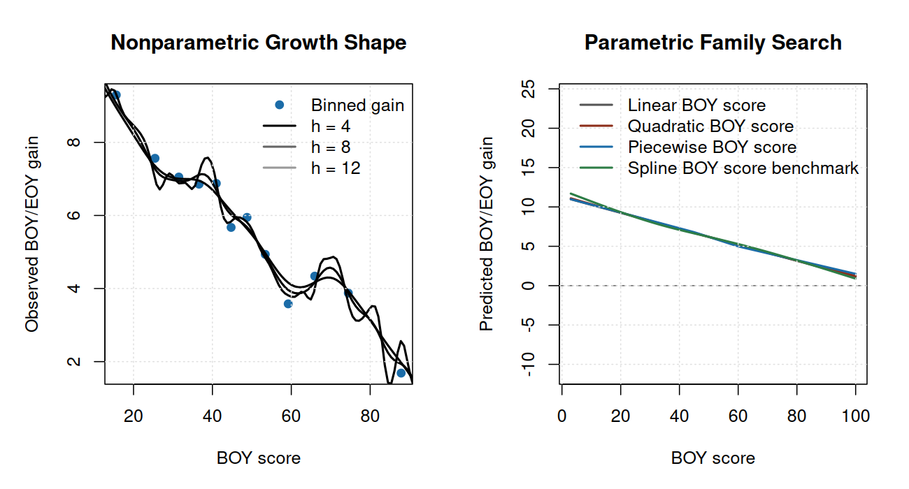

# Assessment Growth and Section Performance Analytics in R

## Recommendation

This study evaluates **beginning-of-year to end-of-year improvement** in a public-safe education assessment extract. The business question is: which course sections improved more or less than expected after accounting for starting performance, readiness, attendance, course track, grade level, and school-year context?

Use BOY/EOY gain as the headline metric, but use **adjusted growth signals** for section review. Raw gains are easy to understand, but they can reward sections that started low and penalize sections that started near a ceiling. The adjusted signal compares observed gain with expected gain for a similar starting profile.

The analysis includes 1,737 paired BOY/EOY records across 174 section-year groups and 5 simulated teachers. The average BOY score is 48.5, the average EOY score is 54.2, and the mean raw gain is 5.72 points.

The selected expected-growth model is **Readiness-augmented**. It achieved holdout RMSE **4.399** and holdout R-squared **0.181**. Section signals should be used for instructional review, curriculum support, and follow-up analysis; they should not be used as automatic teacher evaluation or personnel decisions.

## Direct Answers

1. The main metric is BOY/EOY score improvement: end-of-year score minus beginning-of-year score for the same simulated student in the same section and teacher context.
2. The average raw gain is 5.72 points across 1,737 paired records.
3. Raw section gains are reported, but the primary comparison is adjusted growth: observed section gain minus expected gain from the selected model.
4. The section review layer flags 8 section-year groups above expected growth and 5 below expected growth, with 156 within expected range.
5. The teacher and course summaries are aggregation views for leadership conversations. They are not personnel ratings because the data is public-safe, simulated, and section composition still matters.

## Data Audit

The analysis starts from a public-safe assessment extract. A record enters the growth model only when the same simulated student has valid BOY and EOY scores in the same section and with the same simulated teacher. This keeps the improvement metric tied to a section experience instead of mixing students across sections.

| Measure | Value |
| --- | --- |
| Raw assessment rows | 4,018 |
| BOY/EOY candidate pairs | 2,009 |
| Included paired records | 1,737 |
| Unique public-safe student IDs | 671 |
| Unique section-year groups | 174 |
| Unique simulated teachers | 5 |
| Mean BOY score | 48.5 |
| Mean EOY score | 54.2 |
| Mean BOY/EOY gain | 5.7 |
| Median section paired records | 10 |

The extract uses simulated identifiers and generalized score/readiness behavior from a bootstrapped assessment workflow. It is not a release of real student records or real personnel data.

## Raw Section Improvement

The first layer is descriptive: calculate the BOY/EOY score gain inside each section-year group and run a paired-improvement t-test against zero. This answers whether a section improved, but it does not by itself prove that the section improved more than expected given its starting point.

The table below shows high-signal section-year groups from the review layer, with their raw BOY/EOY t-test results included for context. The full section t-test table is generated as `reports/section_ttests.csv`.

| Section | N | BOY | EOY | Gain | 95% CI | p-value |
| --- | --- | --- | --- | --- | --- | --- |
| 30-31 SEC-006 | 9 | 42.4 | 52.8 | 10.39 | 7.18 to 13.60 | <0.001 |
| 30-31 SEC-019 | 12 | 37.6 | 46.7 | 9.09 | 6.66 to 11.52 | <0.001 |
| 27-28 SEC-017 | 11 | 43.9 | 52.6 | 8.79 | 5.37 to 12.22 | <0.001 |
| 29-30 SEC-017 | 11 | 37.1 | 45.9 | 8.77 | 5.77 to 11.78 | <0.001 |
| 30-31 SEC-008 | 11 | 35.0 | 44.0 | 9.07 | 4.80 to 13.34 | <0.001 |
| 31-32 SEC-002 | 10 | 40.1 | 49.1 | 9.02 | 6.32 to 11.73 | <0.001 |
| 29-30 SEC-003 | 12 | 41.0 | 49.7 | 8.73 | 6.24 to 11.22 | <0.001 |
| 26-27 SEC-006 | 9 | 30.0 | 39.9 | 9.85 | 6.41 to 13.28 | <0.001 |

## Adjusted Growth Model

The adjusted model estimates expected BOY/EOY gain from starting score/readiness and context. This is the key step that makes the analysis more useful than a raw gain ranking: it accounts for floor effects, ceiling effects, attendance context, course track, grade level, and school-year timing.

| Family | Why tested | Decision | CV RMSE | Holdout RMSE |
| --- | --- | --- | --- | --- |
| Context baseline | Tests whether grade, course, attendance, and year context are enough. | Baseline comparator. | 5.078 | 4.802 |
| Linear BOY score | Adds the main baseline achievement signal. | Useful simple challenger. | 4.734 | 4.428 |
| Quadratic BOY score | Tests whether gain changes nonlinearly for very low or high BOY scores. | Compared for nonlinear gain shape. | 4.737 | 4.427 |
| Piecewise BOY score | Uses interpretable score regions to handle floor and ceiling effects. | Interpretable nonlinear challenger. | 4.741 | 4.432 |
| Readiness-augmented | Checks whether readiness adds signal beyond the observed BOY score. | Selected operating model. | 4.700 | 4.399 |
| Spline BOY score benchmark | Flexible benchmark for the baseline-score curve. | Benchmark only; not selected unless it materially improves validation. | 4.745 | 4.422 |

| Model | Selected | Role | Params | CV RMSE | CV SD | CV MAE | CV R2 | Holdout RMSE | Holdout R2 | Delta |
| --- | --- | --- | --- | --- | --- | --- | --- | --- | --- | --- |
| Readiness-augmented | Yes | Selection candidate | 13 | 4.700 | 0.010 | 3.773 | 0.159 | 4.399 | 0.181 | 0.000 |
| Linear BOY score |  | Selection candidate | 12 | 4.734 | 0.009 | 3.782 | 0.147 | 4.428 | 0.170 | 0.034 |
| Quadratic BOY score |  | Selection candidate | 13 | 4.737 | 0.010 | 3.786 | 0.146 | 4.427 | 0.171 | 0.037 |
| Piecewise BOY score |  | Selection candidate | 14 | 4.741 | 0.010 | 3.789 | 0.145 | 4.432 | 0.169 | 0.041 |
| Spline BOY score benchmark |  | Benchmark | 15 | 4.745 | 0.010 | 3.792 | 0.143 | 4.422 | 0.172 | 0.045 |
| Context baseline |  | Selection candidate | 10 | 5.078 | 0.007 | 4.076 | 0.019 | 4.802 | 0.024 | 0.378 |

## Section Performance Signals

For each section-year group, the adjusted signal is the reliability-weighted average residual: observed gain minus expected gain, weighted toward zero for smaller groups. Positive values mean the section improved more than expected for its starting mix; negative values mean it improved less than expected.

| Section | Teacher | N | Raw gain | Expected gain | Adjusted signal | Category |
| --- | --- | --- | --- | --- | --- | --- |
| 30-31 SEC-006 | TCH-002 | 9 | 10.39 | 6.39 | 1.89 | Above expected |
| 30-31 SEC-019 | TCH-005 | 12 | 9.09 | 6.13 | 1.61 | Above expected |
| 27-28 SEC-017 | TCH-005 | 11 | 8.79 | 5.77 | 1.59 | Within expected range |
| 29-30 SEC-017 | TCH-003 | 11 | 8.77 | 5.92 | 1.50 | Above expected |
| 30-31 SEC-008 | TCH-002 | 11 | 9.07 | 6.42 | 1.39 | Within expected range |
| 31-32 SEC-002 | TCH-002 | 10 | 9.02 | 6.33 | 1.35 | Within expected range |
| 29-30 SEC-003 | TCH-002 | 12 | 8.73 | 6.38 | 1.28 | Above expected |
| 26-27 SEC-006 | TCH-002 | 9 | 9.85 | 7.18 | 1.26 | Within expected range |
| 30-31 SEC-009 | TCH-002 | 9 | 2.33 | 6.65 | -2.05 | Below expected |
| 30-31 SEC-002 | TCH-002 | 12 | 2.22 | 5.48 | -1.78 | Within expected range |
| 26-27 SEC-003 | TCH-001 | 9 | 3.27 | 6.45 | -1.50 | Below expected |
| 27-28 SEC-008 | TCH-002 | 13 | 4.04 | 6.69 | -1.50 | Below expected |
| 26-27 SEC-013 | TCH-004 | 10 | 2.27 | 5.25 | -1.49 | Below expected |
| 25-26 SEC-013 | TCH-003 | 11 | 3.99 | 6.64 | -1.39 | Within expected range |
| 31-32 SEC-019 | TCH-005 | 12 | 2.41 | 4.90 | -1.36 | Within expected range |
| 30-31 SEC-001 | TCH-001 | 10 | 3.28 | 5.96 | -1.34 | Below expected |

The full section signal table is generated as `reports/section_adjusted_signals.csv` so reviewers can inspect all section-year groups, not only the highlights shown in the report.

## Instructor and Course Summary

Teacher and course summaries aggregate the section-level evidence. They are useful for spotting patterns that deserve follow-up, such as a course sequence that may need curriculum review or a teacher group whose sections repeatedly exceed expected growth. They should not be treated as standalone teacher quality scores.

| Teacher | Sections | Records | BOY | EOY | Raw gain | Expected gain | Adjusted signal |
| --- | --- | --- | --- | --- | --- | --- | --- |
| TCH-005 | 41 | 420 | 54.6 | 59.4 | 4.81 | 4.77 | 0.04 |
| TCH-002 | 40 | 424 | 39.6 | 46.1 | 6.48 | 6.45 | 0.03 |
| TCH-004 | 36 | 313 | 55.8 | 60.9 | 5.11 | 5.10 | 0.01 |
| TCH-003 | 34 | 351 | 50.6 | 56.5 | 5.95 | 5.94 | 0.01 |
| TCH-001 | 23 | 229 | 40.7 | 47.2 | 6.49 | 6.66 | -0.17 |

| Course | Track | Sections | Records | BOY | EOY | Raw gain | Expected gain | Adjusted signal |
| --- | --- | --- | --- | --- | --- | --- | --- | --- |
| MATH-PRECALC | regular | 21 | 216 | 41.5 | 47.2 | 5.73 | 5.63 | 0.10 |
| MATH-AP-CALC-AB | ap | 27 | 294 | 50.5 | 55.7 | 5.21 | 5.14 | 0.07 |
| MATH-ALG2 | regular | 23 | 236 | 37.2 | 43.8 | 6.57 | 6.52 | 0.05 |
| MATH-BEYOND-CORE | beyond_core | 6 | 21 | 67.7 | 70.8 | 3.08 | 3.08 | 0.00 |
| MATH-ALG2-H | honors | 20 | 198 | 57.6 | 63.8 | 6.12 | 6.12 | 0.00 |
| MATH-GEOM | regular | 31 | 334 | 42.5 | 48.9 | 6.39 | 6.40 | -0.00 |
| MATH-AP-PRECALC | ap | 22 | 214 | 59.2 | 64.3 | 5.10 | 5.14 | -0.04 |
| MATH-AP-CALC-BC | ap | 14 | 131 | 63.7 | 67.5 | 3.86 | 3.97 | -0.11 |
| MATH-ALG1 | regular | 10 | 93 | 38.7 | 45.3 | 6.60 | 6.94 | -0.34 |

## Diagnostics and Sensitivity

The diagnostics below check whether the expected-growth model is centered and whether the raw section rankings materially differ from adjusted rankings.

| Diagnostic | Estimate | Interpretation |
| --- | --- | --- |
| Holdout RMSE | 4.399 | Typical holdout prediction error on BOY/EOY gain |
| Holdout MAE | 3.512 | Average absolute holdout prediction error |
| Holdout R-squared | 0.181 | Share of holdout gain variation explained by the model |
| Residual mean, all pairs | 0.000 | Near 0 means expected gain is centered overall |
| Residual SD, all pairs | 4.599 | Residual spread used to judge section signal uncertainty |

| Measure | Value |
| --- | --- |
| Included paired records | 1,737 |
| Section-year groups | 174 |
| Groups with at least 5 paired records | 169 |
| Groups with at least 8 paired records | 159 |
| Mean raw BOY/EOY gain | 5.72 |
| Raw-vs-adjusted rank correlation | 0.797 |
| Top-10 overlap, raw vs adjusted ranking | 70.0% |

## Bottom Line

- BOY/EOY improvement is the right stakeholder metric because it is easy to explain and aligned with instructional growth.
- Raw improvement should be shown, but adjusted growth should drive section review because starting level, attendance, course track, and ceiling effects matter.
- The strongest use case is instructional review: identify sections that exceed expected growth, sections that lag expected growth, and course patterns that deserve support.
- Avoid framing results as teacher quality rankings. The outputs are public-safe analytical signals, not personnel decisions.

## Reproducibility

Rebuild the full evidence packet with `make all`. The core pipeline uses base R, the included public-safe extract, and no credentials, private files, or network access.

## Public-Safety Statement

This report is an original public-safe portfolio artifact. It excludes private coursework prompts, exams, rubrics, syllabi, lecture transcripts, source datasets, personal data, real student-identifiable records, real personnel records, credentials, and copyrighted source documents.
