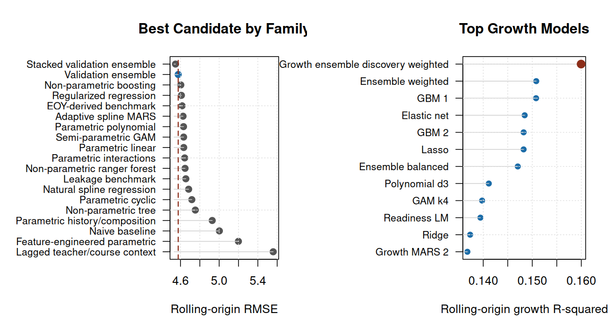
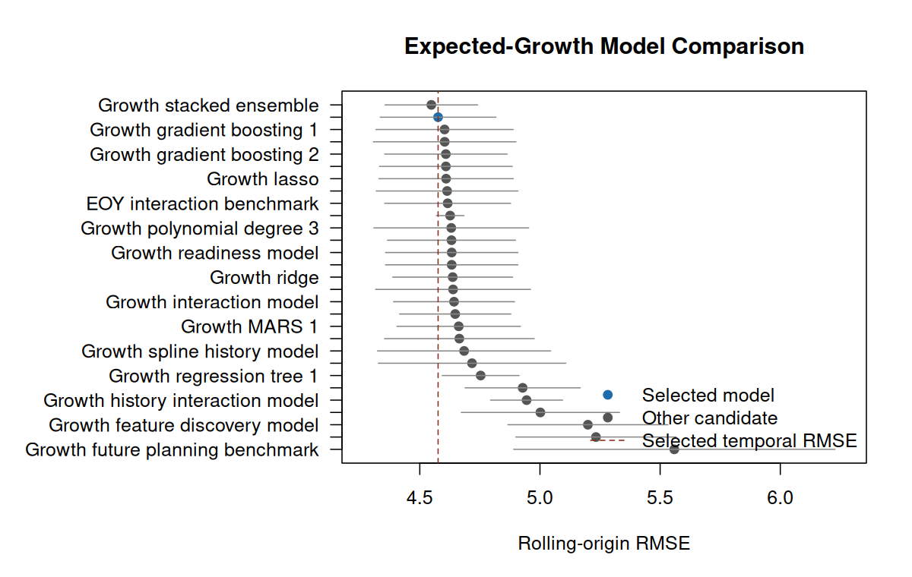
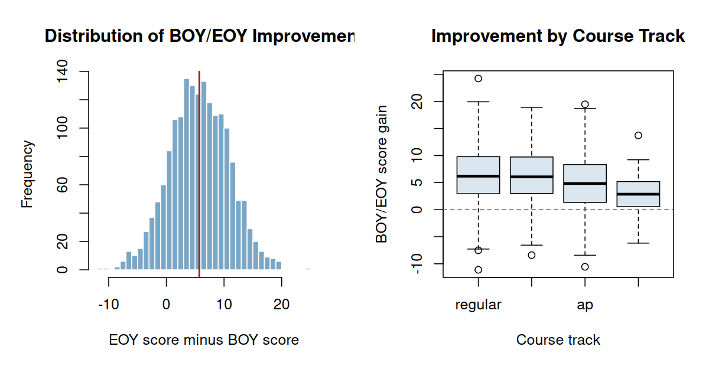
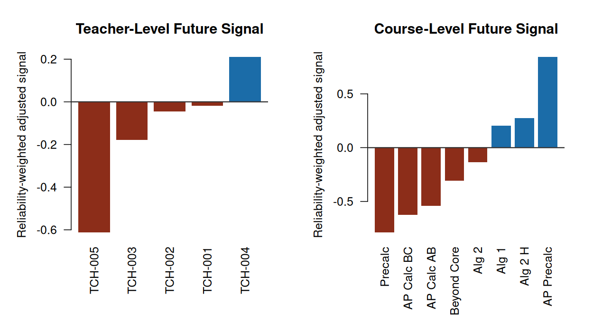
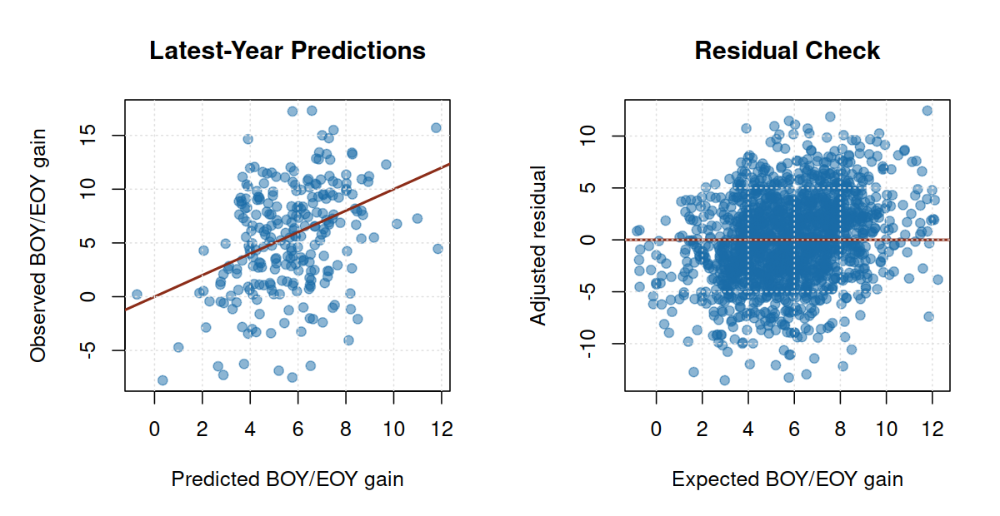

# Assessment Growth and Section Performance Analytics in R

## Recommendation

Use prior completed assessment years to build and validate an expected-growth baseline, then apply that baseline to the latest completed year, **2024-2025**, to identify teacher, course, and section patterns that should receive priority review before the next cycle. The stakeholder metric is **BOY/EOY score gain**: end-of-year score minus beginning-of-year score for the same student record.

Historical years establish expected growth. The latest completed year is scored against that expectation to produce current review priorities.

## How To Read The Model Results

The model is designed for **group-level review**, not individual student forecasting. Individual growth varies because similar students can improve by different amounts for reasons not fully captured in the extract. For that reason, the latest-year individual gain R-squared of **0.115** is a supporting model-quality measure, not the primary decision measure.

The decision question is group-level: after adjusting for starting score, readiness, attendance, prior history, course track, grade level, and section composition, did a teacher, course, or section produce more or less average growth than expected? That comparison is more stable because student-level noise partly averages out across groups.

The EOY R-squared of **0.933** is reported only to show that final score is more directly related to BOY score. It should not be read as evidence that the model precisely predicts improvement. The relevant evidence is out-of-sample lift versus a naive baseline, aggregate fit, residual calibration, uncertainty intervals, and flag stability.

The baseline selected for operations is **Growth ensemble discovery weighted**. It predicts **score gain directly** using a Validation ensemble specification. The selected tuning choice is a validation-weighted blend of boosting, ranger forest, MARS, GAM, regularized regression, and engineered-feature predictions. Against a naive prior-year mean-growth baseline, the selected model improves temporal RMSE by **8.5%** and latest-year RMSE by **6.3%**.

Under the validation framework, this model is best described as **review-priority** evidence: 4 of 7 primary gates passed. The model is useful for structured review and prioritization, while the final interpretation should remain a review process rather than a stand-alone score.

Because decisions are made at aggregate review levels, the planning-level fit is more relevant than the individual gain R-squared: latest-year gain R-squared is **0.263** for section means, **0.524** for course means, and **0.663** for teacher means.

The workflow uses the direct-growth model to create a fair expected-growth baseline, then identifies aggregate teacher, course, and section residuals with bootstrap uncertainty checks and a mixed-effects shrinkage review.

| Slice | Priority or watch rows | Total reviewed |
| --- | --- | --- |
| Teachers | 1 | 5 |
| Courses | 3 | 9 |
| Sections | 8 | 24 |

| Decision | Slice | Target | N | Gap | 95% CI | q |
| --- | --- | --- | --- | --- | --- | --- |
| Watch | Section | S19 | 12 | -2.71 | -5.14 to 0.01 | 0.320 |
| Watch | Section | S04 | 9 | -2.55 | -6.74 to 2.41 | 0.505 |
| Watch | Section | S21 | 12 | -2.48 | -4.99 to -0.18 | 0.267 |
| Watch | Section | S16 | 10 | -2.04 | -4.92 to 0.41 | 0.400 |
| Watch | Section | S23 | 9 | -1.78 | -4.28 to 0.68 | 0.434 |
| Watch | Section | S17 | 9 | -1.57 | -5.06 to 1.99 | 0.505 |
| Watch | Section | S05 | 11 | -1.49 | -4.09 to 1.53 | 0.505 |
| Watch | Section | S22 | 10 | -1.46 | -3.54 to 0.91 | 0.505 |

The labels are review priorities, not personnel ratings or automated decisions.

## Plain-English Method

1. Build a paired BOY/EOY growth extract from public-safe assessment records.
2. Define the business outcome as score gain: EOY score minus BOY score.
3. Use prior completed years to engineer pre-outcome predictors, compare candidate models, and select the expected-growth baseline.
4. Hold out the latest completed year as the action-year review period.
5. Score latest-year records against the prior-year baseline.
6. Aggregate observed-minus-expected growth by teacher, course, and section.
7. Assign review-priority labels when the gap is large enough to matter and the uncertainty checks support follow-up.

This design separates the prediction problem from the decision problem. The prediction model estimates what growth would be expected for a similar starting profile; the review layer asks where actual growth departed from that expectation.

## Direct Answers

1. The analysis covers 1,737 paired BOY/EOY records across 174 section-year groups and 5 teacher identifiers.
2. The training window is 2018-2019, 2019-2020, 2020-2021, 2021-2022, 2022-2023, 2023-2024; the action year is 2024-2025.
3. The average raw gain across the full extract is 5.72 points; the latest-year raw gain is 5.34 points.
4. The model search tested 31 candidate baselines across parametric, nonlinear, ensemble, and excluded ID-benchmark families.
5. The selected direct-growth baseline has temporal expected-gain RMSE 4.576, temporal MAE 3.649, latest-year RMSE 4.646, and latest-year MAE 3.714.
6. The individual gain R-squared is a supporting model-quality measure; the review decision is based on group-level observed-minus-expected growth.
7. Teacher, course, and section flags are review priorities for planning and follow-up, not causal claims or personnel ratings.

## Data Audit

A record enters the growth model only when the same public-safe student has valid BOY and EOY scores in the same section and teacher context. This keeps improvement tied to one instructional experience instead of mixing students across sections.

| Measure | Value |
| --- | --- |
| Raw assessment rows | 4,018 |
| BOY/EOY candidate pairs | 2,009 |
| Included paired records | 1,737 |
| Unique public-safe student IDs | 671 |
| Unique section-year groups | 174 |
| Unique public-safe teacher identifiers | 5 |
| Records with prior-year history | 1,066 |
| Mean section size | 10.4 |
| Mean BOY score | 48.5 |
| Mean EOY score | 54.2 |
| Mean BOY/EOY gain | 5.7 |
| Median section paired records | 10 |

## Model Selection

The model discovery system used 1,485 prior-year pairs and held out 252 latest-year pairs for action-year evaluation. The primary selection metric is stable rolling-origin temporal expected-gain RMSE, not latest-year performance, so each validation year is treated like the future. Candidate-selection folds require at least three prior completed years.

The best eligible direct-growth rolling-origin RMSE was **4.576** from **Growth ensemble discovery weighted**, so it is the operating baseline. Repeated-CV RMSE remains a stability check for candidates that are practically tied on rolling-origin RMSE.

The lowest overall temporal RMSE was **4.548** from **Growth stacked ensemble**, but that row is reported as a benchmark rather than an operating baseline because it is not an eligible direct-growth candidate.

The model-search guardrails were:

- Use direct BOY/EOY score gain as the operating target because that is the stakeholder performance metric.
- Select by stable rolling-origin temporal RMSE so the baseline is judged on future-facing generalization after enough history exists.
- Mark candidates with failed temporal folds as unstable rather than treating implausible extrapolations as credible model comparisons.
- Use repeated-CV RMSE as the tie-breaker when rolling-origin RMSE differs by less than 0.01 points.
- Keep teacher, course, and section identifiers out of the operating baseline because those are the groups being reviewed.
- Use feature engineering only when the feature is available at BOY or from prior completed years.
- Refit the selected production model on all completed years only after model selection.
- Report individual gain R-squared as a supporting model-quality measure, not as the primary decision measure.
- Report EOY R-squared only as context because final score is more directly related to starting score than growth is.

The validation targets below are conservative. They keep the interpretation aligned with the strength of the evidence.

| Gate | Decision-grade | Actual | Status |
| --- | --- | --- | --- |
| Rolling RMSE lift vs naive | 10.0% | 8.5% | Below decision-grade |
| Rolling MAE lift vs naive | 8.0% | 10.1% | Pass |
| Temporal gain R-squared | 0.200 | 0.160 | Below decision-grade |
| Section mean gain R-squared | 0.300 | 0.263 | Below decision-grade |
| Course mean gain R-squared | 0.500 | 0.524 | Pass |
| Teacher mean gain R-squared | 0.600 | 0.663 | Pass |
| Overall residual bias | 0.200 | -0.313 | Review |
| Maximum subgroup residual bias | 0.500 | 3.393 | Review |

The first strength check is whether the selected model beats a naive baseline that predicts the training-year mean gain for every record. This is the minimum bar for using a model as an expected-growth baseline.

| Measure | Value |
| --- | --- |
| Naive temporal RMSE | 5.002 |
| Selected temporal RMSE | 4.576 |
| Temporal RMSE improvement | 8.5% |
| Naive latest-year RMSE | 4.960 |
| Selected latest-year RMSE | 4.646 |
| Latest-year RMSE improvement | 6.3% |
| Naive latest-year MAE | 4.026 |
| Selected latest-year MAE | 3.714 |
| Latest-year MAE improvement | 7.8% |
| Latest-year gain R-squared | 0.115 |
| Latest-year EOY R-squared | 0.933 |
| Section-mean gain R-squared | 0.263 |
| Teacher-mean gain R-squared | 0.663 |
| Course-mean gain R-squared | 0.524 |

<!-- PDF_PAGE_BREAK -->

The table below shows the strongest stable candidate baselines tested. The selected model was chosen by rolling-origin validation, not by whichever model looked best on the latest year. Excluded ID benchmarks and unstable temporal candidates remain in the generated artifacts, but they are not eligible operating baselines.

| Candidate model | Model type | Used? | Rolling RMSE | Latest RMSE | Latest MAE | Gain R2 | Read |
| --- | --- | --- | --- | --- | --- | --- | --- |
| Discovery ensemble | Ensemble | Yes | 4.576 | 4.646 | 3.714 | 0.115 | Selected |
| GBM 1 | Boosting |  | 4.603 | 4.727 | 3.814 | 0.084 | Near tie |
| Ensemble weighted | Ensemble |  | 4.604 | 4.661 | 3.738 | 0.109 | Near tie |
| GBM 2 | Boosting |  | 4.608 | 4.695 | 3.780 | 0.097 | Near tie |
| Growth elastic net | Regularized |  | 4.609 | 4.699 | 3.740 | 0.095 | Near tie |
| Growth lasso | Regularized |  | 4.610 | 4.693 | 3.739 | 0.097 | Near tie |
| Ensemble balanced | Ensemble |  | 4.614 | 4.647 | 3.719 | 0.115 | Near tie |
| MARS 2 | MARS |  | 4.626 | 4.618 | 3.714 | 0.126 | Near tie |

Full model artifacts: [model comparison](growth_model_comparison_display.csv), [model search grid](growth_model_search_grid.csv), [model strength](growth_model_strength.csv), [family summary](growth_model_family_summary.csv), [selection rationale](growth_model_selection_rationale.csv), [temporal validation](model_temporal_validation.csv), [rolling-origin validation](rolling_origin_validation.csv), [process validation](process_validation.csv), [locked holdout](locked_holdout_validation.csv), [validity targets](model_validity_targets.csv), and [bootstrap validation](model_bootstrap_validation.csv).

## Feature Discovery

The model search includes time-appropriate feature engineering: multi-year prior student growth, prior trend and volatility, BOY score bands, section composition, attendance mix, nonlinear basis terms, and selected interactions. The table below shows which features mattered most when permuted in the locked action-year data.

| Feature | RMSE lift if permuted | SD |
| --- | --- | --- |
| boy score | 1.960 | 0.302 |
| boy readiness | 0.440 | 0.097 |
| student prior mean eoy | 0.263 | 0.064 |
| course track | 0.034 | 0.020 |
| grade level | 0.021 | 0.010 |
| student prior year count | 0.007 | 0.007 |
| section student prior mean gain | 0.006 | 0.003 |
| section prior gain mean | 0.005 | 0.008 |
| section readiness mean | 0.004 | 0.004 |
| section boy mean | 0.003 | 0.005 |

Feature stability asks whether the same predictors continue to matter across repeated perturbations.

| Feature | Positive importance | Top-quartile importance |
| --- | --- | --- |
| boy score | 100% | 100% |
| boy readiness | 100% | 100% |
| student prior mean eoy | 100% | 100% |
| course track | 100% | 88% |
| grade level | 100% | 88% |
| student prior year count | 88% | 25% |
| section student prior mean gain | 100% | 0% |
| section prior gain mean | 62% | 25% |
| section readiness mean | 88% | 12% |
| section boy mean | 75% | 12% |

Feature artifacts: [feature importance](feature_importance.csv) and [feature stability](feature_stability.csv).

<!-- PDF_PAGE_BREAK -->

## Latest-Year Review Targets

The latest-year review layer compares observed gain with expected gain for 24 section groups. The review labels use a practical threshold, bootstrap interval direction, BH-adjusted q-values for multiple-review control, flag stability, and a mixed-effects shrinkage check.

| Review | Slice | Target | N | Gap | Stability | Shrinkage | Evidence |
| --- | --- | --- | --- | --- | --- | --- | --- |
| Priority review | Course | Precalc | 40 | -1.38 | Directional | In range | Directional; context review |
| Priority review | Teacher | TCH-005 | 68 | -1.08 | Directional | In range | Directional; context review |
| Bright spot | Course | AP Precalc | 30 | +1.69 | Stable | In range | Stable; shrinkage tempers |
| Bright spot | Section | S13 | 9 | +2.57 | Stable | In range | Stable; shrinkage tempers |
| Watch | Section | S19 | 12 | -2.71 | Stable | In range | Stable watch |
| Watch | Section | S04 | 9 | -2.55 | Stable | In range | Stable watch |
| Watch | Section | S21 | 12 | -2.48 | Stable | In range | Stable watch |
| Watch | Section | S16 | 10 | -2.04 | Stable | In range | Stable watch |
| Watch | Section | S23 | 9 | -1.78 | Stable | In range | Stable watch |
| Watch | Section | S17 | 9 | -1.57 | Directional | In range | Directional watch |

Detailed review tables: [teacher review](latest_teacher_review.csv), [course review](latest_course_review.csv), and [section review](latest_section_review.csv). Reconciled evidence: [evidence reconciliation](review_evidence_reconciliation.csv).

The evidence label reconciles the practical bootstrap flag with the more conservative shrinkage model. When shrinkage tempers a signal, the correct action is context review and support planning rather than escalation.

Shrinkage artifacts: [shrinkage status](shrinkage_status.csv) and [shrinkage review](shrinkage_review.csv). Flag-stability artifacts: [flag stability](flag_stability.csv).

<!-- PDF_PAGE_BREAK -->

## Section Evidence

Raw section improvement is useful for communication, but it is not the final comparison. A section can show positive raw gain and still fall below expected growth if its starting profile suggested a larger increase.

| Section | Course | N | BOY | EOY | Gain | 95% CI | p-value |
| --- | --- | --- | --- | --- | --- | --- | --- |
| S02 | Geometry | 10 | 40.1 | 49.1 | 9.02 | 6.32 to 11.73 | <0.001 |
| S13 | AP Precalc | 9 | 63.5 | 70.7 | 7.18 | 5.20 to 9.16 | <0.001 |
| S18 | AP Calc AB | 13 | 49.4 | 56.1 | 6.69 | 3.06 to 10.31 | 0.002 |
| S11 | AP Precalc | 10 | 69.0 | 74.7 | 5.67 | 1.52 to 9.83 | 0.013 |
| S10 | Alg 2 H | 12 | 63.1 | 70.0 | 6.90 | 3.98 to 9.83 | <0.001 |
| S06 | Alg 2 | 11 | 41.0 | 48.6 | 7.63 | 4.97 to 10.30 | <0.001 |
| S12 | AP Precalc | 11 | 59.5 | 65.1 | 5.64 | 1.86 to 9.43 | 0.008 |
| S01 | Alg 1 | 13 | 42.1 | 49.2 | 7.13 | 4.19 to 10.08 | <0.001 |

<!-- PDF_PAGE_BREAK -->

The adjusted section signal is observed gain minus expected gain, reliability-weighted toward zero for smaller sections.

| Section | Teacher | Course | N | Raw | Expected | Signal | Result |
| --- | --- | --- | --- | --- | --- | --- | --- |
| S02 | TCH-002 | Geometry | 10 | 9.02 | 6.33 | +1.31 | In range |
| S13 | TCH-004 | AP Precalc | 9 | 7.18 | 4.61 | +1.19 | Above |
| S18 | TCH-005 | AP Calc AB | 13 | 6.69 | 5.08 | +0.89 | In range |
| S11 | TCH-004 | AP Precalc | 10 | 5.67 | 4.09 | +0.77 | In range |
| S23 | TCH-005 | AP Calc BC | 9 | 1.89 | 3.67 | -0.82 | In range |
| S05 | TCH-001 | Geometry | 11 | 4.00 | 5.49 | -0.76 | In range |
| S17 | TCH-003 | Precalc | 9 | 4.78 | 6.35 | -0.72 | In range |
| S22 | TCH-005 | AP Calc BC | 10 | 3.10 | 4.56 | -0.71 | In range |

The full section signal table is generated as [section signals](section_adjusted_signals.csv).

<!-- PDF_PAGE_BREAK -->

## Teacher and Course Summaries

These summaries aggregate the latest-year evidence into planning views. They support review conversations about pacing, curriculum alignment, attendance mix, and transferable practices.

| Teacher | Sections | Records | Raw | Expected | Signal |
| --- | --- | --- | --- | --- | --- |
| TCH-004 | 5 | 43 | 5.21 | 4.75 | +0.21 |
| TCH-001 | 3 | 33 | 6.06 | 6.10 | -0.02 |
| TCH-002 | 5 | 52 | 6.60 | 6.69 | -0.04 |
| TCH-003 | 5 | 56 | 5.70 | 6.05 | -0.18 |
| TCH-005 | 6 | 68 | 3.81 | 4.89 | -0.61 |

| Course | Sections | Records | Raw | Expected | Signal |
| --- | --- | --- | --- | --- | --- |
| AP Precalc | 3 | 30 | 6.11 | 4.43 | +0.84 |
| Alg 2 H | 2 | 26 | 6.18 | 5.59 | +0.28 |
| Alg 1 | 1 | 13 | 7.13 | 6.45 | +0.21 |
| Geometry | 4 | 39 | 5.99 | 6.15 | -0.09 |
| Alg 2 | 3 | 33 | 6.57 | 6.83 | -0.14 |
| Beyond Core | 1 | 3 | -0.11 | 3.28 | -0.31 |
| AP Calc AB | 4 | 49 | 4.31 | 5.18 | -0.54 |
| AP Calc BC | 2 | 19 | 2.52 | 4.14 | -0.63 |
| Precalc | 4 | 40 | 4.99 | 6.37 | -0.79 |

<!-- PDF_PAGE_BREAK -->

## Diagnostics and Sensitivity

The baseline is strong for final-score expectation and weaker for individual gain variation. That pattern is expected: BOY score explains much of EOY score, while individual improvement contains more unobserved classroom, attendance, motivation, and assessment variation. For review decisions, the model is used to build expected growth and then aggregate residuals by teacher, course, and section.

| Diagnostic | Estimate | Interpretation |
| --- | --- | --- |
| Latest-year expected-gain RMSE | 4.646 | Typical out-of-sample prediction error on latest-year BOY/EOY gain |
| Latest-year expected-gain R-squared | 0.115 | Share of latest-year gain variation explained by the expected-growth model |
| Latest-year EOY R-squared | 0.933 | Share of latest-year EOY score variation explained by the baseline |
| Latest-year residual mean | -0.313 | Near 0 means expected gain is centered in the action year |
| Latest-year residual SD | 4.644 | Latest-year residual spread used for slice uncertainty |

| Metric | Estimate | 95% interval |
| --- | --- | --- |
| Expected-gain RMSE | 4.646 | 4.254 to 5.026 |
| Expected-gain MAE | 3.714 | 3.355 to 4.035 |
| Expected-gain R-squared | 0.115 | 0.017 to 0.199 |
| EOY RMSE | 4.646 | 4.254 to 5.026 |
| EOY R-squared | 0.933 | 0.918 to 0.944 |

| Metric | Value |
| --- | --- |
| Selected locked-holdout RMSE | 4.646 |
| Naive locked-holdout RMSE | 4.960 |
| Locked-holdout RMSE lift | 6.3% |
| Selected locked-holdout MAE | 3.714 |
| Naive locked-holdout MAE | 4.026 |
| Locked-holdout MAE lift | 7.8% |
| Locked-holdout gain R-squared | 0.115 |

| Diagnostic | Value |
| --- | --- |
| Individual gain SD | 5.079 |
| Student mean-gain R-squared | 0.352 |
| Section mean-gain R-squared | 0.263 |
| Course mean-gain R-squared | 0.524 |
| Teacher mean-gain R-squared | 0.663 |
| Selected train-validation R-squared gap | 0.256 |

| Measure | Value |
| --- | --- |
| Training paired records | 1,485 |
| Latest-year paired records | 252 |
| Latest-year section-year groups | 24 |
| Latest-year mean raw BOY/EOY gain | 5.34 |
| Latest-year raw-vs-adjusted rank correlation | 0.865 |
| Latest-year top-10 overlap, raw vs adjusted ranking | 70.0% |

## Technical Appendix

The operating model excludes teacher IDs, course IDs, and section IDs. An excluded ID benchmark is reported only to show what would happen if persistent IDs were included in the baseline; it is not used for review because it would absorb the same teacher/course patterns the decision layer is designed to examine.

| Package | Installed |
| --- | --- |
| mgcv | Available |
| randomForest | Available |
| ranger | Available |
| gbm | Available |
| rpart | Available |
| glmnet | Available |
| earth | Available |
| lme4 | Available |

| Metric | Value |
| --- | --- |
| Selected model | Growth ensemble discovery weighted |
| Selected target strategy | Direct growth |
| Selected method | Ensemble |
| Selected family | Validation ensemble |
| Selected tuned parameters | Growth gradient boosting 1 weight=2; Growth ranger forest 1 weight=2; Growth MARS 2 weight=1; Growth GAM k4 weight=1; Growth elastic net weight=1; Growth feature discovery model weight=1 |
| Selection rule | Lowest stable rolling-origin temporal RMSE among eligible direct-growth candidates; temporal folds require at least 3 prior completed years, and repeated-CV RMSE is the tie-breaker within 0.01 points |
| Training paired records | 1,485 |
| Latest-year action paired records | 252 |
| Training years | 2018-2019, 2019-2020, 2020-2021, 2021-2022, 2022-2023, 2023-2024 |
| Action year | 2024-2025 |
| Candidate models tested | 31 |
| Operational candidates tested | 26 |
| Excluded ID benchmarks | 5 |
| Repeated CV folds | 5 |
| Repeated CV repeats | 2 |
| Temporal expected-gain RMSE | 4.576 |
| Temporal expected-gain MAE | 3.649 |
| Temporal expected-gain R-squared | 0.160 |
| Temporal expected-gain RMSE SD | 0.241 |
| Temporal EOY R-squared | 0.931 |
| Latest-year expected-gain RMSE | 4.646 |
| Latest-year expected-gain MAE | 3.714 |
| Latest-year expected-gain R-squared | 0.115 |
| Latest-year EOY R-squared | 0.933 |

The full selected-model metrics table is generated as [selected-model metrics](growth_final_metrics.csv).

## Conclusion

The project should be read as a statistical review-priority system. The strongest business value is the workflow: choose a validated expected-growth baseline, compare latest actual growth to that baseline at the group level, quantify uncertainty by slice, reconcile competing evidence checks, and translate the evidence into review priorities.

The recommended stakeholder action is to review the flagged teacher, course, and section patterns before the next assessment cycle. Priority-review rows deserve support-oriented investigation; bright spots deserve study for transferable practices; watch-list rows deserve context review before escalation.

The important limitation is that the data are public-safe and generalized from an assessment workflow. The outputs demonstrate the analysis pattern and should be interpreted as portfolio evidence rather than operational decisions about real students or staff.

## Reproducibility

Rebuild the full evidence packet with `make all`. The pipeline uses the included public-safe extract and no credentials, private files, or network access.

## Public-Safety Statement

This report is an original public-safe portfolio artifact. It excludes private coursework prompts, exams, rubrics, syllabi, lecture transcripts, source datasets, personal data, real student-identifiable records, real personnel records, credentials, and copyrighted source documents.
