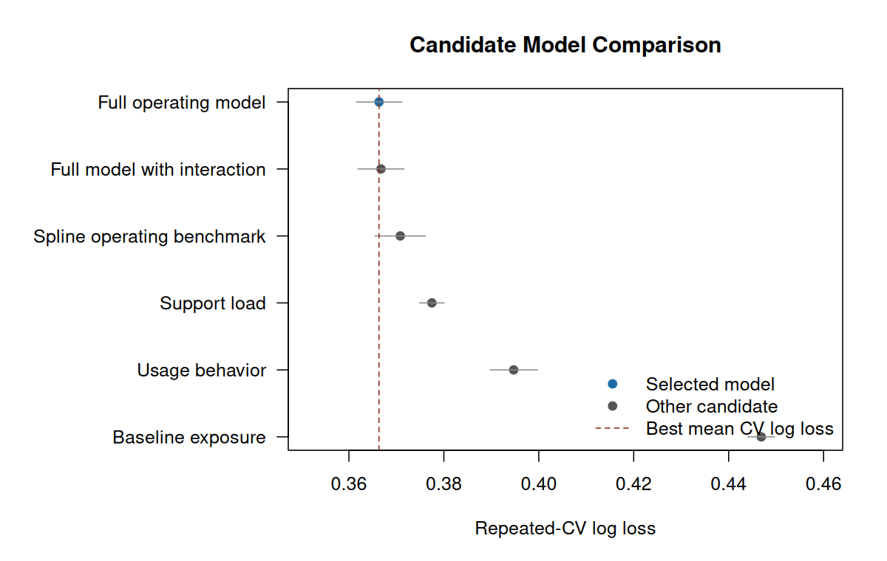
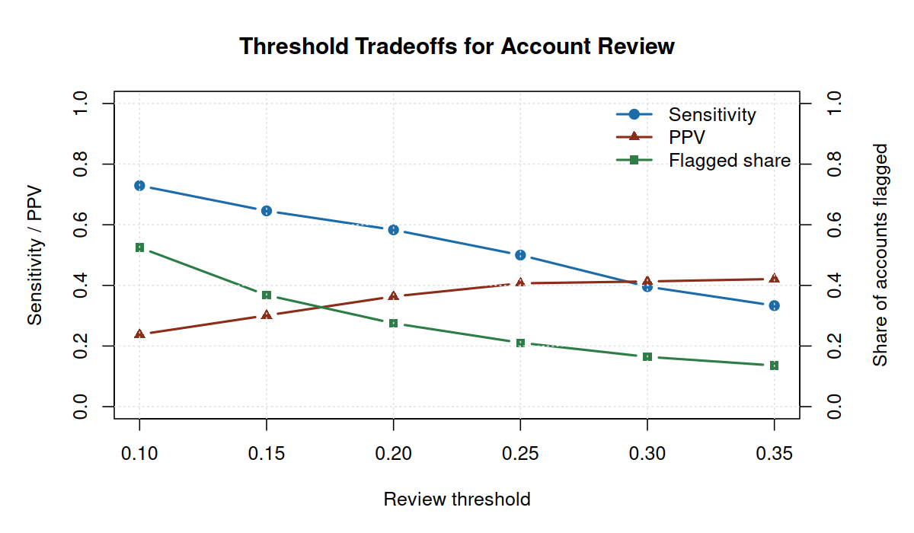
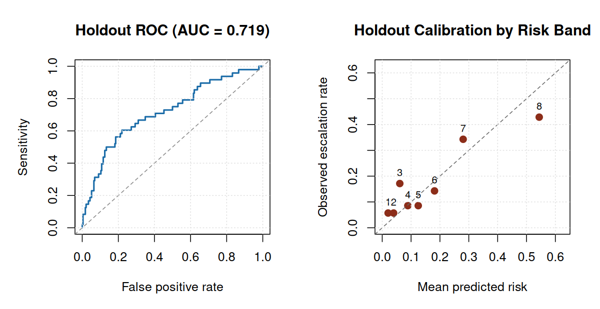
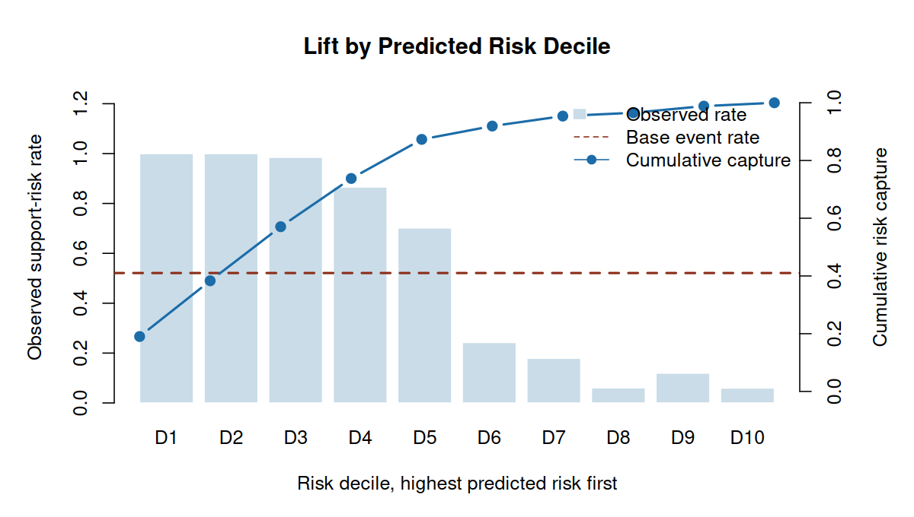
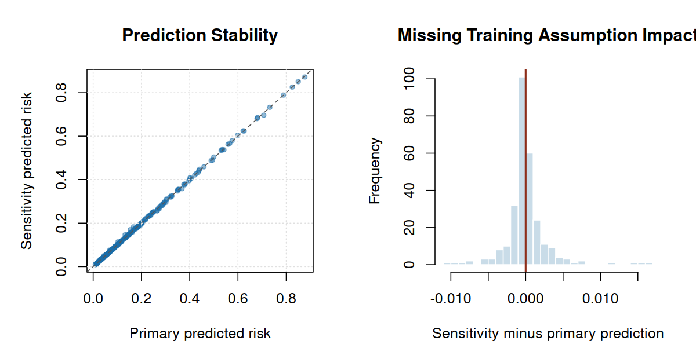
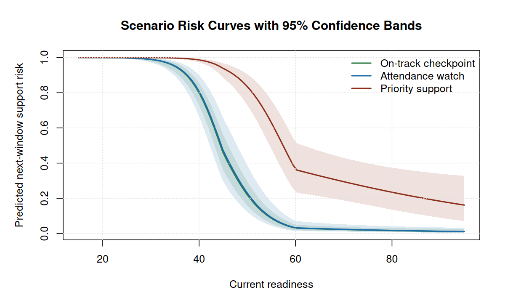

# Education Readiness Risk Modeling in R

## Purpose of the Study

This project asks a practical planning question: when support capacity is limited, which public-safe assessment transitions should be reviewed first before the next assessment window?

The analysis turns current readiness, attendance, assessment-window timing, and course context into a probability of next-window support risk. The goal is not to label a student or automate an academic decision. The goal is to create a transparent review queue that helps a support team focus attention, understand the tradeoffs, and monitor whether the process is working.

## Recommendation

Use the model as a **human review prioritization tool**. A 50% support-review threshold is a reasonable starting point for planning because it balances coverage and workload: it flags 326 of 666 holdout transitions (48.9%) and captures 298 of 347 observed support-risk cases.

If capacity is tighter, the 65% threshold is the next practical option: it flags 283 transitions and captures 267 of 347 observed support-risk cases. The final threshold should be set from available review capacity, intervention cost, and tolerance for missed support needs.

## What This Means Operationally

| Decision | Practical answer |
| --- | --- |
| Who should be reviewed first? | Begin with transitions above the support-review threshold, then use educator context before taking action. |
| What workload does the starting threshold create? | A 50% threshold flags 326 of 666 holdout transitions (48.9%). |
| What coverage does the starting threshold provide? | That threshold captures 298 of 347 observed support-risk cases, or 85.9% of the cases in the holdout set. |
| What if review capacity is tighter? | A 65% threshold flags 283 transitions and captures 267 of 347 observed support-risk cases. |
| What should the model not do? | It should not automatically assign intervention, placement, grading, or discipline decisions. |

The score should be used to decide what gets reviewed first, not what happens automatically. A support team would still confirm context, look at recent trajectory, and decide whether any action is appropriate.

## Key Findings in Plain English

1. Current readiness is the strongest planning signal. Context-only models were much weaker, which means the assessment-readiness evidence adds real prioritization value.
2. The readiness relationship is not just a straight line. Risk changes sharply across readiness regions, so the final model keeps a threshold-like shape while staying explainable.
3. A risk threshold is a staffing decision. Lower thresholds review more transitions and miss fewer support-risk cases; higher thresholds focus effort but leave more cases outside the queue.
4. Risk categories are most useful as workflow labels. They translate probabilities into monitoring, watch-list, review, and priority-review actions.

The ranking view is useful even before choosing a hard cutoff: the highest-risk decile has 1.92x lift over the base rate, and the top two deciles capture 38.3% of observed support-risk cases.

## Risk Categories and Suggested Actions

Risk categories make the model easier to use in a planning conversation. They are operating labels for a public-safe portfolio analysis, not permanent labels for real students.

| Category | Transitions | Observed risk | Observed cases | Suggested use |
| --- | --- | --- | --- | --- |
| Monitor | 298 | 11.1% | 33 | Routine monitoring; no added review solely from this score. |
| Watch | 42 | 38.1% | 16 | Check trend and attendance context before the next assessment. |
| Review | 43 | 72.1% | 31 | Add to the support-team review queue. |
| Priority | 283 | 94.3% | 267 | Review first when support capacity is limited. |

## Data Used

The analysis uses a public-safe assessment extract with one row per assessment window. The modeling table turns consecutive assessment windows into prediction records: current assessment information is used to predict support risk at the next assessment.

| Measure | Value |
| --- | --- |
| Raw assessment rows | 4,018 |
| Modeled transitions | 3,322 |
| Unique public-safe student IDs | 696 |
| Support-risk event rate | 52.1% |
| Current nonparticipation rate | 7.2% |
| Next-window nonparticipation rate | 7.2% |
| Median current readiness | 47.7 |
| Included assessment windows | beginning-of-year, end-of-year |

The extract uses simulated identifiers and generalized assessment behavior from a bootstrapped assessment workflow. It should not be treated as a release of real student-level records.

## Technical Validation Summary

The selected technical model is **Piecewise readiness**. On the holdout set, it achieved AUC **0.938**, log loss **0.309**, and Brier score **0.093**. Repeated cross-validation produced log loss **0.318** and AUC **0.935**.

The holdout event rate is 52.1%, so the evaluation is not based on a rare-event edge case. Bootstrap intervals, calibration diagnostics, lift checks, subgroup calibration, and sensitivity testing are included below.

## Direct Answers

1. The primary modeled outcome is next-window support risk, defined as a next assessment score below 50 or next-window nonparticipation. The holdout event rate is 52.1%.
2. The best operating model is **Piecewise readiness**, selected from interpretable GLM candidates after comparing nonlinear and benchmark model families.
3. The mathematical discovery step matters: Nonparametric smoothing supported a threshold-like readiness curve; piecewise and polynomial candidates were tested against spline and periodic benchmarks.
4. The model is strongest as a prioritization tool. Thresholds convert probabilities into workload, missed-risk, and precision tradeoffs.
5. The analysis is public-safe: it uses simulated identifiers and generalized assessment behavior, and excludes private prompts, exams, real student-identifiable records, credentials, and private source documents.

## Technical Appendix: Model Journey

The model search follows a disciplined workflow: inspect the shape first, test candidate parametric families second, and keep the final model interpretable unless a flexible benchmark clearly earns its complexity.

| Family | Why tested | Decision | CV loss | Holdout AUC |
| --- | --- | --- | --- | --- |
| Context baseline | Tests whether demographic and operating context alone is enough. | Rejected; validation is much weaker without readiness. | 0.643 | 0.673 |
| Linear readiness | Adds the main readiness signal with a simple monotone probability shape. | Rejected; ranking is strong but probability quality is worse. | 0.340 | 0.933 |
| Quadratic readiness | Tests whether risk accelerates near low readiness values. | Rejected; close to selected model, but less directly aligned with the discovered threshold shape. | 0.319 | 0.937 |
| Cubic polynomial readiness | Checks whether a more flexible polynomial improves fit enough to justify instability risk. | Rejected; added polynomial curvature without improving the operating story. | 0.318 | 0.936 |
| Piecewise readiness | Uses the smooth shape discovery to encode separate readiness regions. | Selected as the operating model. | 0.318 | 0.938 |
| Periodic context benchmark | Tests recurring assessment-window structure without making periodicity the headline. | Benchmark only; periodic terms did not justify replacing the operating model. | 0.320 | 0.937 |
| Spline readiness benchmark | Flexible nonlinear benchmark for the readiness curve. | Benchmark only; used to test whether flexible curvature changes the conclusion. | 0.318 | 0.937 |

Candidate logistic models were then compared with repeated stratified 5-fold cross-validation on the training split. Log loss is the primary criterion because a support-prioritization workflow needs useful probabilities, not only rank ordering.

| Model | Selected | Role | Params | CV loss | CV SD | CV AUC | Holdout loss | Holdout AUC | Delta |
| --- | --- | --- | --- | --- | --- | --- | --- | --- | --- |
| Piecewise readiness | Yes | Selection candidate | 15 | 0.318 | 0.001 | 0.935 | 0.309 | 0.938 | 0.000 |
| Cubic polynomial readiness |  | Selection candidate | 15 | 0.318 | 0.001 | 0.935 | 0.313 | 0.936 | 0.000 |
| Spline readiness benchmark |  | Benchmark | 16 | 0.318 | 0.001 | 0.935 | 0.313 | 0.937 | 0.000 |
| Quadratic readiness |  | Selection candidate | 14 | 0.319 | 0.001 | 0.935 | 0.316 | 0.937 | 0.001 |
| Periodic context benchmark |  | Benchmark | 16 | 0.320 | 0.001 | 0.935 | 0.315 | 0.937 | 0.002 |
| Linear readiness |  | Selection candidate | 13 | 0.340 | 0.001 | 0.935 | 0.358 | 0.933 | 0.022 |
| Context baseline |  | Selection candidate | 10 | 0.643 | 0.000 | 0.674 | 0.644 | 0.673 | 0.325 |

The selection rule favors the simplest non-benchmark model within one standard error of the best repeated-CV log loss. That rule protects the portfolio story from choosing a visually impressive model that does not materially improve validated probability quality.

## Technical Appendix: Final Model

| Metric | Value |
| --- | --- |
| Selected model | Piecewise readiness |
| Selection rule | Simplest non-benchmark model within one standard error of best repeated-CV log loss |
| Shape discovery result | Nonparametric smoothing supported a threshold-like readiness curve; piecewise and polynomial candidates were tested against spline and periodic benchmarks. |
| Training rows | 2656 |
| Holdout rows | 666 |
| Training event rate | 52.1% |
| Holdout event rate | 52.1% |
| Repeated CV folds | 5 |
| Repeated CV repeats | 6 |
| CV log loss | 0.318 |
| CV AUC | 0.935 |
| Holdout log loss | 0.309 |
| Holdout Brier score | 0.093 |
| Holdout AUC | 0.938 |
| Calibration intercept | 0.165 |
| Calibration slope | 1.025 |
| Training log loss | 0.312 |
| Training AUC | 0.938 |

Bootstrap intervals give a practical uncertainty band around the holdout metrics.

| Metric | Estimate | 95% CI |
| --- | --- | --- |
| LogLoss | 0.309 | 0.268 to 0.352 |
| Brier | 0.093 | 0.079 to 0.107 |
| AUC | 0.938 | 0.919 to 0.955 |

The adjusted odds ratios below translate the selected GLM into stakeholder-readable effects.

| Predictor | Scale | Odds ratio | 95% CI | p-value |
| --- | --- | --- | --- | --- |
| Grade 10 vs grade 9 | 1-unit / level change | 1.03 | 0.74 to 1.44 | 0.869 |
| Grade 11 vs grade 9 | 1-unit / level change | 1.11 | 0.78 to 1.57 | 0.576 |
| Grade 12 vs grade 9 | 1-unit / level change | 1.08 | 0.65 to 1.80 | 0.770 |
| Honors track vs regular | 1-unit / level change | 1.27 | 0.85 to 1.91 | 0.242 |
| AP track vs regular | 1-unit / level change | 1.25 | 0.91 to 1.73 | 0.173 |
| Beyond-core track vs regular | 1-unit / level change | 2.78 | 0.69 to 11.29 | 0.152 |
| Current window: end of year | 1-unit / level change | 5.62 | 4.18 to 7.56 | <0.001 |
| Attendance category: high absence vs normal | 1-unit / level change | 0.83 | 0.57 to 1.23 | 0.363 |
| Attendance category: at-risk absence vs normal | 1-unit / level change | 1.26 | 0.41 to 3.88 | 0.689 |
| Attendance probability | 0.1-unit change | 0.80 | 0.50 to 1.29 | 0.366 |
| Readiness shortfall below 45 | 5-unit change | 4.73 | 3.60 to 6.23 | <0.001 |
| Readiness gain from 45 to 60 | 5-unit change | 0.34 | 0.29 to 0.39 | <0.001 |
| Readiness gain above 60 | 5-unit change | 0.86 | 0.75 to 0.98 | 0.023 |
| School-year sequence | 1-unit / level change | 0.97 | 0.91 to 1.04 | 0.378 |

## Technical Appendix: Probability Scale

Risk categories provide a bridge between calibrated probabilities and support workflows.

| Category | Transitions | Share | Pred | Obs | Cases |
| --- | --- | --- | --- | --- | --- |
| Monitor | 298 | 44.7% | 11.0% | 11.1% | 33 |
| Watch | 42 | 6.3% | 41.1% | 38.1% | 16 |
| Review | 43 | 6.5% | 56.4% | 72.1% | 31 |
| Priority | 283 | 42.5% | 92.5% | 94.3% | 267 |

A threshold turns probabilities into a work queue. Lower thresholds catch more support-risk cases but create more reviews; higher thresholds focus capacity but miss more students.

| Threshold | Flagged | Flagged % | Captured | Sens | Spec | PPV | NPV |
| --- | --- | --- | --- | --- | --- | --- | --- |
| 35% | 368 | 55.3% | 314 of 347 | 90.5% | 83.1% | 85.3% | 88.9% |
| 45% | 336 | 50.5% | 304 of 347 | 87.6% | 90.0% | 90.5% | 87.0% |
| 50% | 326 | 48.9% | 298 of 347 | 85.9% | 91.2% | 91.4% | 85.6% |
| 55% | 310 | 46.5% | 286 of 347 | 82.4% | 92.5% | 92.3% | 82.9% |
| 65% | 283 | 42.5% | 267 of 347 | 76.9% | 95.0% | 94.3% | 79.1% |
| 75% | 259 | 38.9% | 250 of 347 | 72.0% | 97.2% | 96.5% | 76.2% |

The table below uses illustrative support-planning economics to show how a threshold can be chosen from capacity and intervention assumptions. These values are scenario assumptions, not claims about a real school system.

| Threshold | Flagged | Captured | Benefit | Cost | Net |
| --- | --- | --- | --- | --- | --- |
| 35% | 368 | 314 | $70,650 | $27,600 | $43,050 |
| 45% | 336 | 304 | $68,400 | $25,200 | $43,200 |
| 50% | 326 | 298 | $67,050 | $24,450 | $42,600 |
| 55% | 310 | 286 | $64,350 | $23,250 | $41,100 |
| 65% | 283 | 267 | $60,075 | $21,225 | $38,850 |
| 75% | 259 | 250 | $56,250 | $19,425 | $36,825 |

## Technical Appendix: Model Checks

ROC checks ranking quality. Calibration checks whether predicted probabilities are on the right scale across ordered risk bands.

| Band | N | Pred | Obs | Expected | Cases |
| --- | --- | --- | --- | --- | --- |
| Band 1 | 83 | 2.2% | 8.4% | 1.8 | 7 |
| Band 2 | 83 | 6.3% | 9.6% | 5.2 | 8 |
| Band 3 | 83 | 14.7% | 9.6% | 12.2 | 8 |
| Band 4 | 84 | 32.8% | 25.0% | 27.6 | 21 |
| Band 5 | 83 | 62.0% | 73.5% | 51.4 | 61 |
| Band 6 | 83 | 87.5% | 90.4% | 72.6 | 75 |
| Band 7 | 83 | 98.2% | 100.0% | 81.5 | 83 |
| Band 8 | 84 | 99.9% | 100.0% | 83.9 | 84 |

| Diagnostic | Estimate | Interpretation |
| --- | --- | --- |
| Calibration intercept | 0.165 | Near 0 means predicted risk is not systematically high or low |
| Calibration slope | 1.025 | Near 1 means predicted probabilities are not overly extreme or compressed |

Subgroup calibration checks show where monitoring would matter before operational use. The table reports groups with at least 25 holdout records.

| Group | Level | N | Pred | Obs | Gap | Cases |
| --- | --- | --- | --- | --- | --- | --- |
| course track | ap | 211 | 33.7% | 39.3% | 5.7% | 83 |
| course track | honors | 84 | 33.9% | 29.8% | -4.1% | 25 |
| course track | regular | 368 | 64.0% | 64.7% | 0.6% | 238 |
| assessment window | beginning-of-year | 405 | 45.4% | 49.9% | 4.5% | 202 |
| assessment window | end-of-year | 261 | 58.4% | 55.6% | -2.9% | 145 |
| attendance category | at-risk | 60 | 53.7% | 63.3% | 9.6% | 38 |
| attendance category | high | 285 | 49.6% | 49.5% | -0.1% | 141 |
| attendance category | normal | 321 | 50.7% | 52.3% | 1.7% | 168 |

A ranked queue is often more useful than a single classification cutoff. The lift chart shows how concentrated support-risk cases are in the highest predicted-risk deciles.

| Decile | N | Pred | Obs | Cases | Lift | Capture |
| --- | --- | --- | --- | --- | --- | --- |
| 1 | 66 | 99.9% | 100.0% | 66 | 1.92x | 19.0% |
| 2 | 67 | 99.1% | 100.0% | 67 | 1.92x | 38.3% |
| 3 | 66 | 95.2% | 98.5% | 65 | 1.89x | 57.1% |
| 4 | 67 | 82.0% | 86.6% | 58 | 1.66x | 73.8% |
| 5 | 67 | 58.8% | 70.1% | 47 | 1.35x | 87.3% |
| 6 | 66 | 35.2% | 24.2% | 16 | 0.47x | 91.9% |
| 7 | 67 | 18.8% | 17.9% | 12 | 0.34x | 95.4% |
| 8 | 66 | 10.1% | 6.1% | 4 | 0.12x | 96.5% |
| 9 | 67 | 4.4% | 11.9% | 8 | 0.23x | 98.8% |
| 10 | 67 | 2.0% | 6.0% | 4 | 0.11x | 100.0% |

## Sensitivity Check

The sensitivity analysis lowers the support-risk score cut point from 50 to 45 and refits the selected model family. This tests whether the prioritization story depends on one particular threshold definition.

| Measure | Primary | Sensitivity |
| --- | --- | --- |
| Primary holdout event rate | 52.1% | Reference |
| Sensitivity holdout event rate | Reference | 41.0% |
| Sensitivity holdout log loss | 0.309 | 0.329 |
| Sensitivity holdout Brier score | 0.093 | 0.098 |
| Sensitivity holdout AUC | 0.938 | 0.923 |
| Rank correlation with primary predictions | Reference | 0.989 |
| Top-quintile overlap with primary ranking | Reference | 97.8% |
| Students changing risk category | Reference | 159 of 666 |

## Scenario Profiles

Scenario profiles translate the model into concrete, public-safe support-planning examples with probability intervals.

| Scenario | Grade | Track | Window | Attendance | Readiness | Risk | 95% CI | Category |
| --- | --- | --- | --- | --- | --- | --- | --- | --- |
| On-track checkpoint | 10 | regular | beginning-of-year | normal | 72.0 | 2.1% | 1.3% to 3.6% | Monitor |
| Attendance watch | 9 | regular | beginning-of-year | high | 51.0 | 19.3% | 10.1% to 33.7% | Monitor |
| Priority support | 11 | honors | end-of-year | at-risk | 39.0 | 99.0% | 97.9% to 99.5% | Priority |

## Bottom Line

- Start with the 50% review threshold as a planning default, then adjust for staffing capacity and support cost.
- Use the ranked queue to prioritize human review and early support planning, not to automate student-level decisions.
- Keep the piecewise readiness model because it captures the discovered nonlinear risk pattern while staying easier to explain than a flexible spline.
- Monitor calibration by course track, assessment window, and attendance group before treating risk categories as stable operating labels.

## Reproducibility

Rebuild the full evidence packet with `make all`. The core pipeline uses base R, the included public-safe extract, and no credentials, private files, or network access.

## Public-Safety Statement

This report is an original public-safe portfolio artifact. It excludes private coursework prompts, exams, rubrics, syllabi, lecture transcripts, source datasets, personal data, patient data, school-private records, credentials, and copyrighted source documents.
