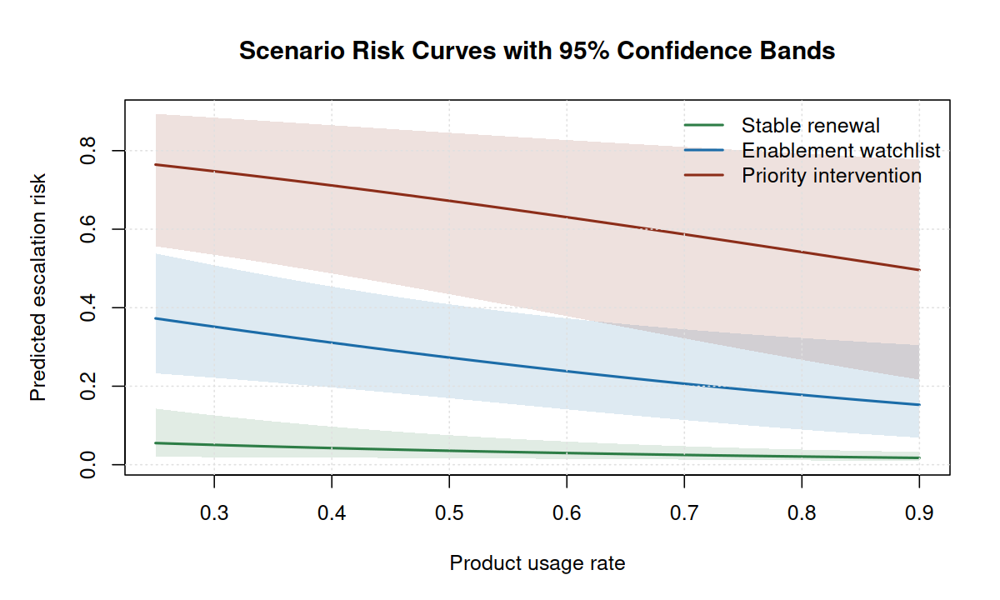

# Statistical Risk Modeling in R

## Executive Summary

This public-safe project models the probability that a synthetic B2B account will require escalation review in the next quarter. The selected interpretable GLM is **Full operating model**, chosen using repeated stratified cross-validation and checked on a holdout set.

On the holdout set, the model achieved AUC **0.719**, log loss **0.422**, and Brier score **0.129**. Cross-validation produced log loss **0.366** and AUC **0.797** for the selected model.

At a 20% review threshold, the workflow flags 77 holdout accounts (27.5%), captures 28 of 48 observed escalations, and produces PPV 36.4%. This threshold is a planning option, not a final policy: review capacity and intervention cost should set the operating point.

The ranking view is stronger than a threshold alone: the highest-risk decile has 2.71x lift over the base event rate, and the top two deciles capture 50.0% of observed escalations. Under the illustrative economics assumptions documented below, the best tested threshold is 15% with net value $127,350.

## Data Overview

The dataset contains 1,400 synthetic account records. The generated escalation rate is 17.1%, and 10.8% of accounts have missing training-completion values.

Predictors include account segment, region, contract value, tenure, product usage, active-seat ratio, training completion, support tickets, response time, prior incidents, and implementation complexity. No real customer, student, patient, credential, or private course data is used.

## Model Journey

Candidate logistic models were compared with repeated stratified 5-fold cross-validation on the training split. Log loss is the primary criterion because the business problem needs calibrated probabilities, not only rank ordering. A spline benchmark is included as a flexible model-family check, but the operating model is selected from interpretable GLM candidates.

| Model | Selected | Role | Parameters | CV_log_loss | CV_log_loss_SD | CV_AUC | Holdout_log_loss | Holdout_AUC | Delta_CV_log_loss |
| --- | --- | --- | --- | --- | --- | --- | --- | --- | --- |
| Full operating model | Yes | Selection candidate | 15 | 0.366 | 0.005 | 0.797 | 0.422 | 0.719 | 0.000 |
| Full model with interaction |  | Selection candidate | 16 | 0.367 | 0.005 | 0.798 | 0.422 | 0.721 | 0.000 |
| Spline operating benchmark |  | Benchmark | 21 | 0.371 | 0.005 | 0.792 | 0.424 | 0.717 | 0.004 |
| Support load |  | Selection candidate | 9 | 0.377 | 0.003 | 0.781 | 0.442 | 0.674 | 0.011 |
| Usage behavior |  | Selection candidate | 10 | 0.395 | 0.005 | 0.756 | 0.435 | 0.686 | 0.028 |
| Baseline exposure |  | Selection candidate | 6 | 0.447 | 0.003 | 0.619 | 0.456 | 0.576 | 0.081 |


The selected model uses a one-standard-error rule: pick the simplest model whose repeated-CV log loss is statistically close to the best candidate. This keeps the model easier to explain when extra terms do not materially improve probability quality.

## Validation Metrics

| Metric | Value |
| --- | --- |
| Selected model | Full operating model |
| Selection rule | Simplest model within one standard error of best repeated-CV log loss |
| Training rows | 1120 |
| Holdout rows | 280 |
| Training event rate | 17.1% |
| Holdout event rate | 17.1% |
| Repeated CV folds | 5 |
| Repeated CV repeats | 6 |
| CV log loss | 0.366 |
| CV AUC | 0.797 |
| Holdout log loss | 0.422 |
| Holdout Brier score | 0.129 |
| Holdout AUC | 0.719 |
| Calibration intercept | 0.035 |
| Calibration slope | 0.655 |
| Training log loss | 0.349 |
| Training AUC | 0.820 |

Bootstrap intervals give a practical uncertainty band around the holdout metrics.

| Metric | Estimate | Bootstrap_95_CI |
| --- | --- | --- |
| LogLoss | 0.422 | 0.346 to 0.515 |
| Brier | 0.129 | 0.103 to 0.160 |
| AUC | 0.719 | 0.637 to 0.797 |

## Coefficient Interpretation

The table reports adjusted odds ratios for the selected model. Continuous predictors are scaled to business-readable increments where useful.

| Predictor | Scale | Odds_ratio | CI_95 | P_value |
| --- | --- | --- | --- | --- |
| Contract value, log scale | 1-unit / level change | 0.84 | 0.57 to 1.26 | 0.406 |
| Tenure | 12-unit change | 0.86 | 0.76 to 0.96 | 0.007 |
| Segment: Mid-Market vs SMB | 1-unit / level change | 0.90 | 0.51 to 1.57 | 0.701 |
| Segment: Enterprise vs SMB | 1-unit / level change | 0.57 | 0.24 to 1.33 | 0.194 |
| Segment: Strategic vs SMB | 1-unit / level change | 1.54 | 0.47 to 5.11 | 0.476 |
| Implementation complexity: Medium vs Low | 1-unit / level change | 1.05 | 0.68 to 1.62 | 0.823 |
| Implementation complexity: High vs Low | 1-unit / level change | 1.26 | 0.74 to 2.15 | 0.390 |
| Product usage rate | 0.1-unit change | 0.89 | 0.75 to 1.06 | 0.200 |
| Active-seat ratio | 0.1-unit change | 0.86 | 0.73 to 1.02 | 0.077 |
| Training completion | 0.1-unit change | 0.85 | 0.73 to 0.99 | 0.036 |
| Training completion missing | 1-unit / level change | 0.88 | 0.49 to 1.57 | 0.655 |
| Support tickets, last 90 days | 3-unit change | 1.81 | 1.34 to 2.46 | <0.001 |
| Average response time | 12-unit change | 1.39 | 1.11 to 1.76 | 0.005 |
| Prior incident | 1-unit / level change | 2.19 | 1.48 to 3.22 | <0.001 |

## Diagnostics

ROC checks ranking quality, while calibration checks whether predicted probabilities are on the right scale across risk bands.


| Risk_band | N | Mean_predicted | Observed_rate | Expected_events | Observed_events |
| --- | --- | --- | --- | --- | --- |
| Band 1 | 35 | 2.0% | 5.7% | 0.7 | 2 |
| Band 2 | 35 | 3.9% | 5.7% | 1.4 | 2 |
| Band 3 | 35 | 6.1% | 17.1% | 2.1 | 6 |
| Band 4 | 35 | 8.9% | 8.6% | 3.1 | 3 |
| Band 5 | 35 | 12.5% | 8.6% | 4.4 | 3 |
| Band 6 | 35 | 18.1% | 14.3% | 6.3 | 5 |
| Band 7 | 35 | 28.0% | 34.3% | 9.8 | 12 |
| Band 8 | 35 | 54.4% | 42.9% | 19.0 | 15 |

| Diagnostic | Estimate | Interpretation |
| --- | --- | --- |
| Calibration intercept | 0.035 | Near 0 means predicted risk is not systematically high or low |
| Calibration slope | 0.655 | Near 1 means predicted probabilities are not overly extreme or compressed |

Segment and implementation-complexity calibration checks help identify where monitoring should continue after deployment.

| Subgroup | Level | N | Mean_predicted | Observed_rate | Calibration_gap | Observed_events |
| --- | --- | --- | --- | --- | --- | --- |
| segment | Enterprise | 58 | 8.8% | 13.8% | 5.0% | 8 |
| segment | Mid-Market | 112 | 15.6% | 14.3% | -1.3% | 16 |
| segment | SMB | 92 | 23.0% | 22.8% | -0.2% | 21 |
| segment | Strategic | 18 | 17.9% | 16.7% | -1.2% | 3 |
| implementation_complexity | High | 55 | 35.7% | 38.2% | 2.5% | 21 |
| implementation_complexity | Low | 111 | 12.3% | 9.9% | -2.4% | 11 |
| implementation_complexity | Medium | 114 | 11.9% | 14.0% | 2.1% | 16 |

## Threshold Interpretation

A threshold turns probabilities into an operating workflow. Lower thresholds catch more events but increase review burden; higher thresholds concentrate risk but miss more events.


| Threshold | Flagged | Flagged_share | Events_captured | Sensitivity | Specificity | PPV | NPV |
| --- | --- | --- | --- | --- | --- | --- | --- |
| 10% | 147 | 52.5% | 35 of 48 | 72.9% | 51.7% | 23.8% | 90.2% |
| 15% | 103 | 36.8% | 31 of 48 | 64.6% | 69.0% | 30.1% | 90.4% |
| 20% | 77 | 27.5% | 28 of 48 | 58.3% | 78.9% | 36.4% | 90.1% |
| 25% | 59 | 21.1% | 24 of 48 | 50.0% | 84.9% | 40.7% | 89.1% |
| 30% | 46 | 16.4% | 19 of 48 | 39.6% | 88.4% | 41.3% | 87.6% |
| 35% | 38 | 13.6% | 16 of 48 | 33.3% | 90.5% | 42.1% | 86.8% |

The table below translates the threshold choices into an illustrative operating economics frame. Assumptions: $750 review cost per flagged account, $12,000 avoided escalation cost, and 55% intervention effectiveness for captured events. These are scenario assumptions, not claims about a real business.

| Threshold | Flagged | Events_captured | Avoided_loss | Review_cost | Net_value |
| --- | --- | --- | --- | --- | --- |
| 10% | 147 | 35 | $231,000 | $110,250 | $120,750 |
| 15% | 103 | 31 | $204,600 | $77,250 | $127,350 |
| 20% | 77 | 28 | $184,800 | $57,750 | $127,050 |
| 25% | 59 | 24 | $158,400 | $44,250 | $114,150 |
| 30% | 46 | 19 | $125,400 | $34,500 | $90,900 |
| 35% | 38 | 16 | $105,600 | $28,500 | $77,100 |

## Lift and Prioritization

A ranked queue is often more useful than a single classification cutoff. The lift table shows how much event concentration appears in each predicted-risk decile.


| Decile | N | Mean_predicted | Observed_rate | Events | Lift | Cumulative_capture |
| --- | --- | --- | --- | --- | --- | --- |
| 1 | 28 | 58.4% | 46.4% | 13 | 2.71x | 27.1% |
| 2 | 28 | 32.6% | 39.3% | 11 | 2.29x | 50.0% |
| 3 | 28 | 22.1% | 17.9% | 5 | 1.04x | 60.4% |
| 4 | 28 | 16.2% | 10.7% | 3 | 0.62x | 66.7% |
| 5 | 28 | 12.0% | 10.7% | 3 | 0.62x | 72.9% |
| 6 | 28 | 9.1% | 10.7% | 3 | 0.62x | 79.2% |
| 7 | 28 | 6.9% | 17.9% | 5 | 1.04x | 89.6% |
| 8 | 28 | 4.9% | 7.1% | 2 | 0.42x | 93.8% |
| 9 | 28 | 3.5% | 7.1% | 2 | 0.42x | 97.9% |
| 10 | 28 | 1.8% | 3.6% | 1 | 0.21x | 100.0% |

Risk categories provide an executive-friendly bridge between probabilities and action queues.

| Risk_category | Accounts | Share | Mean_predicted | Observed_rate | Observed_events |
| --- | --- | --- | --- | --- | --- |
| Monitor | 133 | 47.5% | 5.0% | 9.8% | 13 |
| Watch | 70 | 25.0% | 14.2% | 10.0% | 7 |
| Review | 39 | 13.9% | 26.2% | 30.8% | 12 |
| Priority | 38 | 13.6% | 52.9% | 42.1% | 16 |

## Sensitivity Analysis

The primary model imputes missing training completion with segment medians and includes a missingness indicator. The sensitivity model uses a conservative assumption: missing training completion is treated as zero. This tests whether the operating story depends on a favorable missing-data assumption.


| Measure | Primary | Sensitivity |
| --- | --- | --- |
| Holdout log loss | 0.422 | 0.421 |
| Holdout Brier score | 0.129 | 0.129 |
| Holdout AUC | 0.719 | 0.719 |
| Mean absolute probability change | Reference | 0.16% |
| Accounts changing risk category | Reference | 2 of 280 |
| Maximum absolute probability change | Reference | 1.64% |

## Scenario Profiles

Scenario profiles translate the model into concrete account-review examples with probability intervals. These are synthetic profiles used for communication and model interpretation.



| Scenario | Segment | Complexity | Usage | Support_tickets_90d | Response_hours | Prior_incident | Predicted_risk | CI_95 | Risk_category |
| --- | --- | --- | --- | --- | --- | --- | --- | --- | --- |
| Stable renewal | Mid-Market | Low | 82.0% | 1 | 7 | 0 | 2.0% | 1.1% to 3.7% | Monitor |
| Enablement watchlist | SMB | Medium | 55.0% | 4 | 16 | 0 | 25.5% | 15.5% to 39.0% | Review |
| Priority intervention | Enterprise | High | 35.0% | 8 | 28 | 1 | 73.0% | 51.2% to 87.4% | Priority |

## Decision-Support Implications

- Use predicted risk to prioritize human account review, not to automate account decisions.
- Choose the review threshold based on available review capacity, expected intervention cost, and tolerance for missed escalations.
- Monitor calibration by segment and implementation complexity before treating risk bands as stable operating categories.
- Refit and recalibrate the model when product usage, support operations, or customer mix materially changes.

## Reproducibility

Rebuild the full evidence packet with:

```bash
make all
```

The build uses base R only and does not require package installation, network access, credentials, or private data.

## Public-Safety Statement

This report is an original public-safe portfolio artifact. It excludes private coursework prompts, exams, rubrics, syllabi, lecture transcripts, source datasets, personal data, patient data, school-private records, credentials, and copyrighted source documents.
